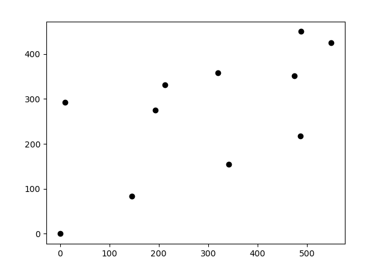
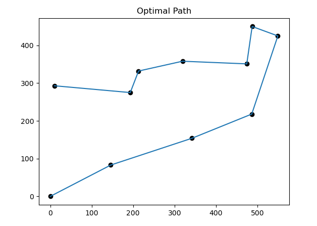
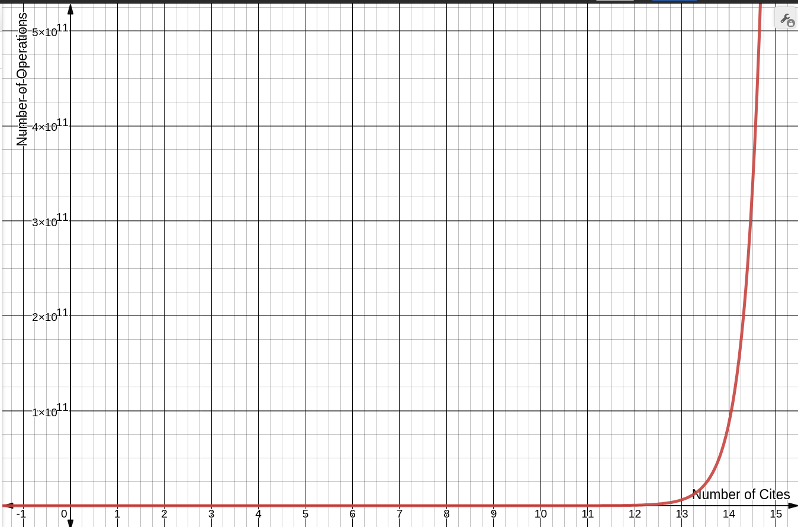
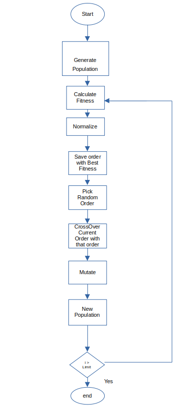

# Traveling Salesman Problem Using Genetic Algorithm


## Requirenments

Python 3.7+

Librairies

- Random

- Math

- Matplotlib

## Run It


Run Genetic_Algorithm.py

```shell
python3 Genetic_Algorithm.py
```

Change the parameters  according to your need in tsp.py like

> height =600
> 
> width = 600
> 
> num_cities =12
> 
> population_size = num_cities*10


The Reference is taken from [here](https://www.youtube.com/watch?v=M3KTWnTrU_c)


## The Problem

A path has to be genrated for a salesman to visit all the given cities (atleast once) such that the distance travelled by them is minimum.The salesman is currently at (0,0)

Consider the following Eg 



Fig: Randomly Generated Coordinates of Cities (except 0,0)




  Fig : The optimal path requiring minimum distance to be travelled


                                                        

### Brute Force Approch

The brute force approch consist of considering each city as starting point and generating all rest of the (n-1)! permutaion resulsting in a time complexity of Θ(n!), where n is the number of cities to be visited.



                                  Fig: Number of Operations vs Number of Cities {using [this](https://www.desmos.com/calculator)}


The Brute Force approch is thus not optimal


### Genetic Algorithm

The Genetic algorithm is a method for solving both constrained and unconstrained optimization  problems that is based on natural selection, the process that drives biological evolution. The genetic algorithm repeatedly modifies a population of individual solution.

The Genetic algorithms may not generate the most optimal path every time but it can generate a nearly optimal path every time.



                                                Fig: FlowChart of Genetic Algorithm


